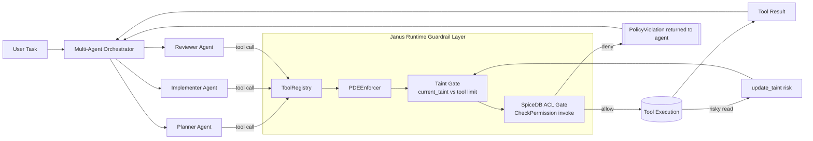

# Janus Code Understanding

## Purpose

Janus is a Python security layer for LLM agents. It enforces least-privilege controls at the **tool execution boundary** (not only prompt/output filtering), so each tool call is checked against policy before execution.

## High-Level Architecture

Core runtime path:

1. `JanusAgent` (`janus/agent.py`) receives user input.
2. `LLMRunner` (`janus/llm/runner.py`) runs the conversation/tool loop.
3. `ToolRegistry` (`janus/tools/registry.py`) resolves and executes tools.
4. `PolicyEnforcer` (`janus/policy/enforcer.py`) or `PDEEnforcer` (`janus/policy/pde_enforcer.py`) allows or blocks calls.

If a call is blocked, the error is surfaced as a message so the model can adapt rather than crashing the loop.

## Main Components

### 1) Agent Orchestration
- `janus/agent.py`
- `JanusAgent` wires together:
  - model provider selection (`<provider>/<model-name>` parsing)
  - tool registration (built-in + custom)
  - policy engine (`janus` or `pde`)
  - conversation runner
- Supports `policy="generate"` to auto-generate policy on first run.

### 2) Tool Execution Layer
- `janus/tools/base.py`: `ToolDef` and `ToolParam`
- `janus/tools/registry.py`: registration, schema export, enforcement-aware execution
- Built-ins in `janus/tools/builtin/`:
  - `file_tools.py`: workspace-scoped file access with traversal protection
  - `command_tools.py`: shell command and URL fetch helpers

### 3) LLM Abstraction
- `janus/llm/base.py`: provider interface
- `janus/llm/providers/`: OpenAI, Anthropic, Google/Gemini, Azure, Bedrock, Ollama, vLLM, Together, OpenRouter
- `janus/llm/runner.py`: stateful chat loop + tool-calling loop with max-iteration guard

### 4) Policy Engine (Default)
- `janus/policy/enforcer.py`
- JSON-policy rules are evaluated by priority:
  - `effect=0` allow
  - `effect=1` deny
  - condition checks use JSON Schema per argument
- Default behavior:
  - If policy is loaded: unknown/unmatched tools are blocked.
  - If no policy is loaded: calls are allowed.
- Policy loading/saving/validation:
  - `janus/policy/loader.py`
  - `janus/policy/validator.py`

### 5) Policy Generation
- `janus/policy/generator.py`
- LLM-driven generation/refinement using Jinja templates in `janus/prompts/`
- Converts model output into internal policy tuple format.

### 6) PDE Engine (Optional)
- `janus/policy/pde_enforcer.py` wraps PDE behind enforcer-like API
- `janus/policy/pde/interceptor.py` applies:
  1. taint threshold gate (`TOOL_TAINT_LIMIT`)
  2. SpiceDB ACL gate (`CheckPermission`)
- `janus/policy/pde/config.py`: schema + taint constants
- `janus/policy/pde/bootstrap.py`: schema/relationship bootstrap helpers

#### Why PDE is "dynamic"

PDE is dynamic because authorization can change during a single run based on what the
agent has already consumed.

- Session starts with `taint=0`.
- After reading a risky source (e.g., external URL/report), `update_taint(...)` raises taint.
- On every subsequent tool call, PDE re-evaluates:
  1. **Taint gate**: block if `current_taint > TOOL_TAINT_LIMIT[tool]`
  2. **SpiceDB ACL gate**: block if role lacks `invoke` permission
- Result: a tool that was allowed earlier can become blocked later without editing policy JSON.

Example from demos: after external lab ingestion raises taint to medium/high, high-impact
actions such as portal publish or external network calls are blocked automatically.

## Multi-Agent Architecture (with Janus + PDE)

The diagram below shows a typical Planner -> Implementer -> Reviewer workflow where each
agent's tool call is mediated by Janus before execution.

## Adapters / Integration Depth

### LangChain (`janus/adapters/langchain.py`)
- `secure_langchain_tools`: convert `ToolDef` list to guarded `StructuredTool`s
- `wrap_langchain_tools`: retrofit existing LangChain tools
- `JanusLangChainAgent`: turnkey LangChain agent with Janus enforcement

### Google ADK (`janus/adapters/adk.py`)
- `secure_adk_tools`: Gemini function declarations + guarded handlers
- `JanusADKAgent`: turnkey ADK/Gemini function-calling loop

## Examples and Demo Framework

- CLI runner: `examples/run.py`
- Web demo: `examples/app.py` (FastAPI + WebSocket)
- Scenario orchestration: `examples/shared/scenario_runner.py`
- Scenario discovery: `examples/scenarios/__init__.py`

Notable built-in scenarios:
- `demo1_poisoned_readme`: hidden instruction attempts `.env` read + exfiltration; policy blocks restricted paths/domains.
- `demo2_supply_chain`: typosquat README tries to induce malicious writes; read-only policy blocks edits/writes.
- `demo5_taint_cascade`: PDE/SpiceDB + taint escalation blocks higher-risk actions (e.g., push) after risky reads.

## Security Posture (Code-Level)

- Enforcement is deterministic and centralized at tool execution.
- Built-in file tools are workspace-sandboxed.
- Supports strict deny-by-default when policy exists.
- Optional PDE adds graph-based authorization and dynamic taint-based privilege reduction.

## Important Operational Notes

- Package metadata: `pyproject.toml` (`janus-guard`, Python `>=3.11`).
- Demo dependencies require extras (`langchain`, `all`, `dev` as needed).
- PDE scenarios require running SpiceDB (`examples/docker-compose.yml`).

## Practical Mental Model

Think of Janus as a **policy firewall for agent tools**:
- the LLM can propose actions,
- but Janus decides which concrete tool invocations are executable,
- based on static policy (JSON Schema) and optionally dynamic trust state (PDE taint + ACLs).

## Comparison: `trustworthy-adk`, `sondera-harness-python`, and Janus

| Dimension | `trustworthy-adk` (documented) | `sondera-harness-python` (documented) | Janus (implemented) |
| --- | --- | --- | --- |
| Primary scope | Security-focused extensions for Google ADK agents | Deterministic guardrail harness for agent frameworks and custom agents | General security layer for tool-using agents with adapters |
| Security model | Action-Selector pattern, HITL plugin, soft instruction defense | Cedar policy evaluation with deterministic allow/deny + steer/block strategies | Deterministic tool-call policy enforcement; optional PDE taint + ACL |
| Enforcement point | ADK agent/plugin behavior | Pre-action harness/middleware gate before tool/action execution | Tool execution boundary (`ToolRegistry` + enforcer) |
| Prompt injection handling | Direct focus (action selector and prompt sanitization) | Indirectly via deterministic policy constraints on actions/parameters | Indirectly mitigated by blocking disallowed tool calls |
| Human oversight | Built-in HITL plugin for sensitive tools | Not a core HITL feature in top-level docs; focuses on policy decisions with reasons | Not core default; can be implemented via policy/tool design |
| Policy representation | Pattern/plugin configuration | Cedar policies (e.g., forbid rules on parameters/context) | Explicit JSON policy rules with schema-validated conditions |
| Runtime trust adaptation | Not highlighted in docs beyond plugin behavior | Deterministic decisions; can return deny reason to steer retries | Optional dynamic trust via taint thresholds and SpiceDB checks |
| Framework coupling | ADK-centric | Integrations for LangGraph/LangChain, ADK, Strands, plus custom | Multi-provider + adapters (LangChain and ADK) |
| Built-in analysis | Agentic profiler and security metrics tooling | Strong observability/audit posture for actions and policy decisions | Scenario-driven demos and policy enforcement traces |
| Autonomy strategy | Minimizes autonomy (`max_iterations=1`) in action selector | Keeps autonomy but constrains actions with deterministic policy middleware | Allows iterative tool loop with guardrails and max-iteration limit |

### Practical takeaway

- `trustworthy-adk` is strongest as an **ADK-native secure pattern/plugin toolkit**.
- `sondera-harness-python` is strongest as a **deterministic Cedar-policy harness with middleware integrations and auditability**.
- Janus is strongest as a **policy firewall for tool execution across agent ecosystems**, including optional graph + taint-based controls.
- These approaches can be complementary depending on stack: pattern/plugin controls (`trustworthy-adk`), deterministic middleware policy (`sondera-harness-python`), and tool-boundary enforcement with optional dynamic trust controls (Janus).
